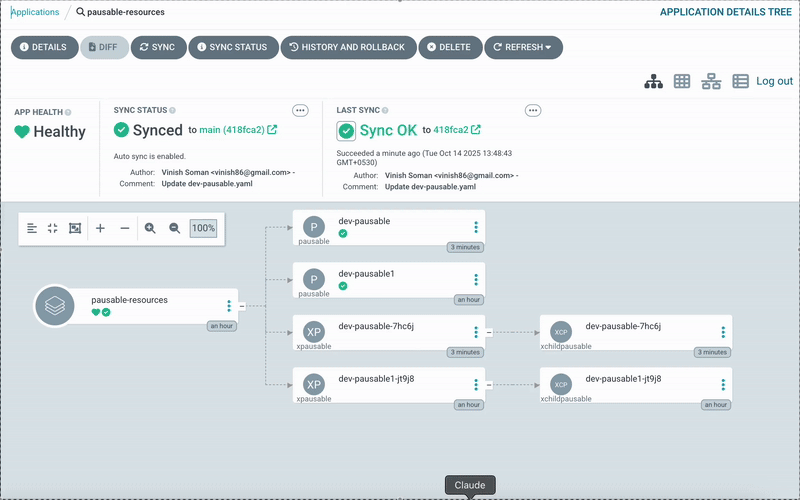
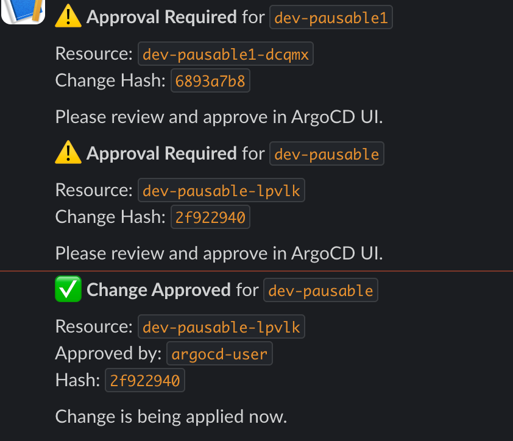

# Crossplane ArgoCD Approval System

A GitOps-based approval workflow for Kubernetes resources using Crossplane and ArgoCD. This system allows you to pause infrastructure changes and require manual approval before they are applied.



## Overview

This project demonstrates an approval workflow where:
- **Changes are automatically paused** when Pausable resources are modified
- **Slack notifications** alert teams when approval is needed
- **ArgoCD provides a UI** with an "Approve Change" button
- **Approvals are tracked** via Kubernetes annotations
- **GitOps workflow** enables version-controlled infrastructure changes

### Slack Notifications



The system automatically sends Slack notifications when:
- ⚠️ **Approval Required** - A change is detected and needs review
- ✅ **Change Approved** - An approval is granted and change is being applied

## Architecture

The system consists of two custom resource types:

1. **Pausable** - The main resource that requires approval for changes
2. **ChildPausable** - Child resources managed by Pausable

The approval workflow uses **annotations** on Pausable resources rather than separate approval objects, keeping the architecture simple and efficient.

### How It Works

```
1. User commits change to Git → ArgoCD detects change
2. Composition detects spec change and pauses ChildPausable resource
3. User sees paused state in ArgoCD UI with "Approve Change" button
4. User clicks "Approve Change" button
5. Button adds approval annotations:
   - approval.example.io/approved-hash: <current-hash>
   - approval.example.io/approved-by: argocd-user
   - approval.example.io/approved-via: argocd-ui
6. Composition reads annotations, verifies hash, and unpauses
7. Change is applied to ChildPausable resource
```

## Prerequisites

### Required Tools:
- **Kubernetes cluster** - kind, minikube, or any K8s cluster (v1.19+)
- **kubectl** - Kubernetes CLI (v1.19+) configured and connected to your cluster
- **Helm** - Helm 3+ for installing Crossplane
- **Git** - For GitOps workflow (pushing changes to trigger approvals)
- **ArgoCD CLI** - Required for user creation and password management

### System Versions:
- **Crossplane** - v1.17.6 (with `--enable-environment-configs` flag)
- **ArgoCD** - v2.14.17
  ```bash
  # macOS
  brew install argocd
  
  # Linux
  curl -sSL -o argocd https://github.com/argoproj/argo-cd/releases/latest/download/argocd-linux-amd64
  chmod +x argocd
  sudo mv argocd /usr/local/bin/
  ```

### Optional Tools:
- **htpasswd** - For custom ArgoCD admin password (during installation)
  ```bash
  # macOS
  brew install httpd
  
  # Linux
  sudo apt-get install apache2-utils
  ```
- **curl** - Used by scripts for health checks (usually pre-installed)
- **lsof** - For port checking (usually pre-installed)

### Verify Prerequisites:

```bash
# Check required tools
kubectl version --client
helm version
git --version
argocd version --client

# Check optional tools
htpasswd -h 2>&1 | head -1
curl --version
lsof -v 2>&1 | head -1
```

## Quick Start

### 1. Install the System

Run the automated installation script:

```bash
./scripts/install-all.sh
```

This will:
- Install ArgoCD with approval UI button
- Install Crossplane with required functions (go-templating, auto-ready, environment-configs)
- Install HTTP Provider for Slack notifications
- Prompt for Slack webhook URL and create EnvironmentConfig
- Deploy Custom Resource Definitions (XRDs)
- Deploy Compositions with integrated Slack notifications
- Configure ArgoCD RBAC and custom actions
- Setup GitOps repository integration (default: https://github.com/vinish86/crossplane-argocd-approval.git)

**Default GitOps Settings:**
- Repository: `https://github.com/vinish86/crossplane-argocd-approval.git`
- Path: `gitops-repo/pausables`
- Branch: `main`

You can override these defaults during installation or press Enter to use the defaults.

### 2. Access ArgoCD UI

Start port-forwarding:

```bash
./scripts/port-forward.sh
```

Get the admin password:

```bash
./scripts/get-argocd-password.sh
```

Access ArgoCD at: https://localhost:8080

### 3. Test the Approval Workflow

#### Option A: Direct Apply (Manual Testing)

Create a Pausable resource:

```yaml
apiVersion: pausable.crossplane.io/v1alpha1
kind: Pausable
metadata:
  name: my-resource
spec:
  environment: dev
  replicas: 1
  message: "Initial deployment"
```

Update the resource to trigger approval:

```bash
kubectl edit pausable my-resource
# Change replicas or message
```

The change will be paused automatically. Go to ArgoCD UI and click "Approve Change" on the resource.

#### Option B: GitOps Workflow (Recommended)

1. **Setup your Git repository** with the ArgoCD Application:

The installation script automatically configures this using the default repository. If you want to use your own repository, you can manually apply:

```yaml
apiVersion: argoproj.io/v1alpha1
kind: Application
metadata:
  name: pausable-resources
  namespace: argocd
spec:
  project: default
  source:
    repoURL: https://github.com/vinish86/crossplane-argocd-approval.git
    targetRevision: main
    path: gitops-repo/pausables
  destination:
    server: https://kubernetes.default.svc
    namespace: default
  syncPolicy:
    automated:
      prune: true
      selfHeal: false  # CRITICAL: Must be false for approval workflow
```

2. **Commit Pausable resources** to your repository:

```bash
# In your Git repository (uses default path: gitops-repo/pausables)
mkdir -p gitops-repo/pausables
cat > gitops-repo/pausables/dev-pausable.yaml <<EOF
apiVersion: pausable.crossplane.io/v1alpha1
kind: Pausable
metadata:
  name: dev-resource
spec:
  environment: dev
  replicas: 1
  message: "Hello from GitOps"
EOF

git add gitops-repo/pausables/
git commit -m "Add dev pausable resource"
git push
```

3. **Make changes** by updating the file in Git:

```bash
# Update the resource
vim gitops-repo/pausables/dev-pausable.yaml
# Change replicas: 2

git add gitops-repo/pausables/dev-pausable.yaml
git commit -m "Scale to 2 replicas - requires approval"
git push
```

4. **Approve in ArgoCD UI**:
   - Open ArgoCD UI
   - Find the `pausable-resources` application
   - Click on the Pausable resource
   - Click the "Approve Change" button
   - The change will be applied!

## Project Structure

```
.
├── docs/
│   └── images/
│       └── approval-workflow.gif     # Demo GIF for README
├── manifests/
│   ├── 01-argocd/          # ArgoCD configuration
│   │   ├── argocd-app.yaml           # Application template
│   │   ├── argocd-users.yaml         # User accounts & RBAC config
│   │   ├── custom-action.yaml        # "Approve Change" button
│   │   └── rbac-permissions.yaml     # K8s RBAC for ArgoCD
│   ├── 02-providers/       # Crossplane Providers
│   │   ├── http-provider.yaml        # HTTP provider for notifications
│   │   ├── http-providerconfig.yaml  # HTTP provider config
│   │   └── slack-environment-config.yaml.example # Slack webhook template
│   ├── 03-crds/            # Custom Resource Definitions
│   │   ├── pausable-xrd.yaml         # Main Pausable XRD
│   │   ├── child-pausable-xrd.yaml   # Child resource XRD
│   │   └── slack-notification-xrd.yaml # Slack notification XRD
│   ├── 04-compositions/    # Crossplane Compositions
│   │   ├── pausable-composition.yaml      # Main approval logic with Slack
│   │   ├── child-pausable-composition.yaml # Child resource composition
│   │   └── slack-notification-composition.yaml # Slack notification logic
│   └── 05-functions/       # Crossplane Functions
│       └── functions.yaml              # All required functions
├── gitops-repo/            # Sample GitOps repository structure
│   ├── pausables/          # Store your Pausable resources here
│   └── slack-notifications/ # Slack notification examples
│       └── example-notification.yaml # Sample notification
└── scripts/                # Automation scripts
    ├── install-all.sh               # Main installation script (prompts for Slack)
    ├── create-argocd-users.sh       # Create approver & reader users
    ├── get-argocd-password.sh       # Get ArgoCD password
    ├── set-argocd-password.sh       # Set custom password
    └── port-forward.sh              # Port-forward ArgoCD
```

## Key Features

### 1. Automatic Change Detection
- Any update to a Pausable resource triggers the approval workflow
- Changes are detected by comparing current and desired specs
- Annotations track the approval state

### 2. ArgoCD UI Integration
- Custom "Approve Change" button in ArgoCD UI
- Button is only visible on cluster-scoped XPausable resources (security best practice)
- Uses ArgoCD's custom action framework
- **Role-based access control**: Only users with `role:approver` or `role:admin` can execute approvals
- Namespaced Pausable resources require kubectl approval for additional security

### 3. Annotation-Based Approval
- `approval.example.io/approved-hash` - Hash of approved spec (for verification)
- `approval.example.io/approved-by` - User who approved the change
- `approval.example.io/approved-via` - Method of approval (e.g., argocd-ui)
- Annotations are added by ArgoCD button and read by Crossplane composition

### 4. GitOps Compatible
- Works seamlessly with Git-based workflows
- ArgoCD syncs from Git repository
- Manual approval required for changes (selfHeal: false)

### 5. Slack Notifications
- **Automatic approval workflow notifications** - Alerts sent when approval is needed and when changes are approved
- Webhook URL stored in EnvironmentConfig (secure, gitignored)
- Uses HTTP provider with DisposableRequest resources
- Notifications include resource name, change hash, and approver information
- Easy to configure during installation (script prompts for webhook URL)
- Update anytime: `kubectl edit environmentconfig slack-config`

## Configuration

### Slack Notifications

The installation script will prompt you to configure Slack notifications. You'll need a Slack webhook URL.

**Get a Slack Webhook URL:**
1. Go to https://api.slack.com/apps
2. Create a new app or select an existing one
3. Enable "Incoming Webhooks"
4. Click "Add New Webhook to Workspace"
5. Select the channel and authorize
6. Copy the webhook URL

**During Installation:**
The script will prompt: "Configure Slack notifications? (Y/n)"
- Enter your webhook URL when prompted
- The script creates an EnvironmentConfig with your URL
- All notifications will be sent to your Slack channel

**Update Webhook Later:**
```bash
kubectl edit environmentconfig slack-config
# Update the webhookUrl field
```

**Skip Slack During Installation:**
If you skip Slack configuration during installation, you can add it later:

```bash
# Create from template
cp manifests/02-providers/slack-environment-config.yaml.example \
   manifests/02-providers/slack-environment-config.yaml

# Edit with your webhook URL
vim manifests/02-providers/slack-environment-config.yaml

# Apply
kubectl apply -f manifests/02-providers/slack-environment-config.yaml
```

### ArgoCD Password

Set a custom ArgoCD password:

```bash
./scripts/set-argocd-password.sh YOUR_PASSWORD
```

### Approval Permissions (RBAC)

#### Option 1: Dedicated Users (Recommended)

Create dedicated `approver` and `reader` users (both use same password as admin):

```bash
./scripts/create-argocd-users.sh
```

This creates:
- **`approver` user:** Can view applications and execute "Approve Change" button
- **`reader` user:** Can only view applications (no approvals, no other actions)
- **Password:** Both users use the same password as admin (for convenience)

**Login credentials:**
```
URL: https://localhost:8080

Admin:    username: admin    | Full access
Approver: username: approver | View + Approve
Reader:   username: reader   | View only
```

**Benefits:**
- ✅ Approve button visible ONLY to approver user
- ✅ Reader users cannot see or execute approval actions
- ✅ Single password for all users (same as admin)
- ✅ Principle of least privilege
- ✅ Clear audit trail

#### Option 2: Role-Based Access (Multiple Users)

Add multiple users to approver role by editing `manifests/01-argocd/argocd-users.yaml`:

```yaml
# In the policy.csv section under "Assign users to roles", add:
g, alice, role:approver
g, bob, role:approver
g, devops-team, role:approver
```

**Role capabilities:**
- `role:readonly` - Can view applications, cannot approve
- `role:approver` - Can view and approve changes
- `role:admin` - Full access

**Apply changes:**
```bash
kubectl apply -f manifests/01-argocd/argocd-users.yaml
kubectl rollout restart deployment/argocd-server -n argocd
```

**Using SSO/OIDC groups:**
```yaml
# Map SSO groups to roles
g, my-company:approvers, role:approver
g, my-company:admins, role:admin
```

### GitOps Repository

The installation script uses these default values:
- Repository: `https://github.com/vinish86/crossplane-argocd-approval.git`
- Path: `gitops-repo/pausables`
- Branch: `main`

You can override these during installation or apply manually with your own values:

```bash
# Update argocd-app.yaml with your repository details
kubectl apply -f manifests/01-argocd/argocd-app.yaml
```

## Troubleshooting

### Changes Not Being Paused

Check the Pausable resource annotations:

```bash
kubectl get pausable <name> -o yaml | grep annotations -A 5
```

### Approve Button Not Showing

Verify custom action is configured:

```bash
kubectl get cm argocd-cm -n argocd -o yaml | grep -A 20 "resource.customizations.actions"
```

Restart ArgoCD server if needed:

```bash
kubectl rollout restart deployment/argocd-server -n argocd
```

### Changes Not Applied After Approval

Check if the approval annotation is present:

```bash
kubectl get pausable <name> -o jsonpath='{.metadata.annotations.pausable\.crossplane\.io/approved}'
```

View composition logs:

```bash
kubectl get events --sort-by='.lastTimestamp'
```

## How the Approval System Works

### 1. Detection Phase
When a Pausable resource is updated:
- Crossplane composition calculates hash of current spec
- Compares with previous hash in status
- If different, pauses the ChildPausable resource
- Updates status with `approvalStatus: "false"`

### 2. Approval Phase
User reviews the change in ArgoCD UI:
- ArgoCD shows "Approve Change" button (only when paused)
- User clicks the button
- Button adds annotations:
  - `approval.example.io/approved-hash: <spec-hash>`
  - `approval.example.io/approved-by: argocd-admin`
  - `approval.example.io/approved-via: argocd-ui`

### 3. Application Phase
Composition detects approval:
- Reads approval annotations
- Verifies approved-hash matches current spec hash
- Unpauses ChildPausable resource
- Updates status with approval metadata
- Change is applied!

## Advanced Usage

### Custom Approval Logic

Modify the composition to add custom approval logic:

```yaml
# In pausable-composition.yaml - check-approval-exist step
# Add custom approval requirements (e.g., multiple approvers, time windows)
{{ $approvedHash := index $annotations "approval.example.io/approved-hash" | default "" }}
{{ $approvedBy := index $annotations "approval.example.io/approved-by" | default "" }}

{{ if and (eq $approvedHash $currentHash) (eq $approvedBy "admin") }}
  {{ $approvalStatus = "true" }}
{{ end }}
```

### Multi-Environment Setup

Deploy different Pausable resources per environment:

```bash
# production-pausable.yaml
apiVersion: pausable.crossplane.io/v1alpha1
kind: Pausable
metadata:
  name: prod-resource
  annotations:
    environment: production
    approval-required: "true"
spec:
  environment: production
  # ...
```

## Contributing

This is a demonstration project showing how to implement approval workflows with Crossplane and ArgoCD. Feel free to adapt it to your needs.

## License

MIT License - Feel free to use and modify for your needs.

## Resources

- [Crossplane Documentation](https://docs.crossplane.io/)
- [ArgoCD Documentation](https://argo-cd.readthedocs.io/)
- [ArgoCD Custom Actions](https://argo-cd.readthedocs.io/en/stable/operator-manual/resource_actions/)
- [Crossplane Composition Functions](https://docs.crossplane.io/latest/concepts/composition-functions/)
